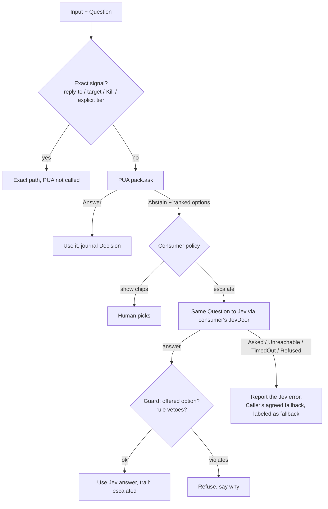

# SPEC: PUA, the Predictable Universal Advisor (`pua-*` crates)

Status: **draft for review, spec only.** No code beyond empty crate stubs.  
Repo: [`hexuria/pua`](https://github.com/hexuria/pua) (its own repo; consumers pin by git tag or rev, §3.2)  
Toolchain: Rust **1.99.0** (`rust-toolchain.toml`, owner rule), edition 2024, `#![forbid(unsafe_code)]`,
workspace lints (`unsafe_code = "forbid"`, `unwrap_used = "deny"`).  
Supersedes: `hexuria/opengrok-server` `docs/prd/deterministic-resonance-library-spec.md` (branch
`auto-steer`, PR #369), which now points here. The `delivery-advisor-spec.md` in that PR becomes the
**autosteer pack** (§6.1).

**Name.** "Predictable" means **deterministic**: the same input gives the same scores, with no
sampling. Same input + same pack data + same profile → byte-identical `Decision` (§5). Confidences are
integer scores on a 0–1000 scale. They are **not** calibrated probabilities.

**Grounding.**

- **A §n** is the codebase analysis of 2026-10-05. It's box-local (`illuminati-steer/codebase-analysis.md`)
  and not committed. Upstream code is cited as `repo path:line` at the commits listed in A §0:
  opengrok-server `a08635a`, open-ai-gateway `efc906e`, nativechat `c645315`, hyper-use `c074de5`,
  buwiz-forms `f8e8cbc`, cred-swap `265d4fe`, gol `4dee334`.
- **GDL p.N** is Jorge Muñoz Fuentes, *Geometric Deep Learning, A Mathematical Perspective*
  (Sept 2026). `p.N` is the **PDF** page (printed page = PDF page − 24). Box-local reading notes are in
  `illuminati-steer/gdl-book-notes.md`. "Inference" marks where this spec applies a book idea the book
  itself doesn't state.

---

## 1. Goal and non-goals

**Goal.** One family of pure Rust crates that makes small, closed-world text and structure decisions:

- **predictable:** same input + same data gives byte-identical output; no sampling, clocks or RNG
- **explainable:** every answer carries its stage trail and spans in the original text
- **abstain-first:** it says "not sure" rather than guess
- **local:** CPU-only, microseconds to milliseconds, no network

Each product reuses it through thin **packs** (data + adapter).

**Position in the stack.** PUA is **tier 0, below Jev**. Jev remains the heavier tier above it.

| Tier | What | Latency | Output |
|---|---|---|---|
| 0 | **PUA** (`pua-*`, this spec) | µs–ms, local, deterministic | Noul / Choice / Score answer, or **Abstain** |
| 1 | TypeSafe **Jev** (System One decision model) | ~70–500 ms (vendor figure), network | the same three shapes |
| 2 | Frontier LLM via open-ai-gateway | seconds | generation |

PUA is **not** "System One". That is TypeSafe's name for Jev (A §3; `/workspace/jev-research/jev-catalog.md:9-17`).

**Non-goals.**

- No LLM, GPU, gradient training, sampling, network or async in any PUA crate.
- Not a grammar checker and not a clone of BCSC's FMM. Their public docs inspired the *pipeline shape*
  only (delivery-advisor spec §1.1).
- Never overrides exact signals: reply-to, explicit target, Kill/stop on a `run_id`, explicit tier.
- Never claims a TIN is valid. The check digit is unverified (A §5.1; buwiz-forms
  `rules/shared/tin-validation.json`, `shared-tin-001`).
- Not hyper-use's `HgraMatcher`. hyper-use is credited as prior art and is not a dependency (A §4.2).
  No crate is named `hgra` (hyper-use `docs/DECISIONS.md:5-6`).
- No learned canonicalization, symmetry discovery, spectral graph features or other learned-model ideas
  from GDL (GDL §6 of the notes). Those belong at the Jev tier or nowhere.

## 2. Use cases

| Use case | Stages used | Output | Consumer hook |
|---|---|---|---|
| AutoSteer delivery advice | text, lexicon, rules, (hdc only after PRD Phase B) | Choice{queue, steer, interrupt} or Abstain | NativeChat `plan_send` Auto (§7.1) |
| Workflow `match` step | text, lexicon, rules, hdc | Choice over the step's labels, else escalate to `ask` | opengrok-tools `workflow.rs` (§7.2) |
| Redaction pre-filter | text, rules | Noul per cred-swap candidate, else Jev | opengrok-server `jev/reviewer.rs` (§7.2) |
| Gateway shape features | text | integer feature counts (no tier) | oag-router `RequestSignal` (§7.3) |
| COR OCR label extraction | text (offset map), lexicon, graph (layout) | fields + original spans + confidence | buwiz-forms `cor_ocr.rs` (§7.4) |
| BIR field suggestions | text, lexicon, rules, graph (layout) | Choice candidates (format repair, catalog codes) | bir-core suggestion contract (§7.4) |
| Tool selection | text, lexicon, graph, hdc | Choice over a tool catalog, or Abstain | opengrok-server / hyper-use tool routing (§6.5) |
| JevCue intent probe (later) | text, lexicon, rules | Choice or "call Jev" | `/workspace/jev-voice-computer-use/ARCHITECTURE.md:83-97` |

## 3. Repo layout (`hexuria/pua`)

A single Cargo workspace. Library crates sit under `crates/`, packs under `packs/`:

```text
Cargo.toml                    workspace: members, [workspace.package], [workspace.lints]
rust-toolchain.toml           channel = "1.99.0" (owner rule)
LICENSE                       MIT, same as the other hexuria repos
docs/spec.md                  this file
crates/
  pua-core/      Answer, Question shapes, Millis, Span, DataVersion, Stage/Decider traits,
                 profiles, decision (thresholds, top-2 margin, abstain)
  pua-text/      NFC, folds (ASCII | Unicode, Ñ-preserving), offset map, protected spans,
                 token and sentence spans, confusable flag; the canonicalization stage (§5.2)
  pua-lexicon/   closed vocab: token-boundary exact, longest-known-code, bounded edit
                 distance + QWERTY adjacency; no substring matching by default
  pua-rules/     compiled rule packs (cue, negation, scope); no regex in rule data
  pua-hdc/       packed bipolar vectors, seeded encoder, bind/bundle/permute,
                 codebook, cleanup, resonator
  pua-graph/     LabeledGraph, 1-WL colour refinement, WL fingerprints (§4.8)
  pua-explain/   trail, reasons, scorer kind, replay record (serde), diff of two replays
  pua-jev/       Jev wire shapes (noul/choice/score) <-> core types; NO HTTP client
packs/
  pua-pack-autosteer/
  pua-pack-gateway-shape/
  pua-pack-bir-fields/
  pua-pack-ocr-labels/
  pua-pack-tool-selection/
```

Today the repo holds only the workspace manifest, the toolchain pin and empty stubs (`lib.rs` with
`#![forbid(unsafe_code)]` and a doc comment, no dependencies). Code lands phase by phase (§10).

Each pack crate will hold `data/` (TOML source), a `build.rs` or `include_str!` step that compiles the
data into static tables, an adapter function, and `fixtures/` + `tests/`. This follows buwiz-forms'
`rules/ → crates/bir-rules` codegen pattern, where data is never parsed at runtime from mutable files
(A §5.1; buwiz-forms `crates/bir-rules/README.md:1-40`).

### 3.1 Dependency rules

PUA must be consumable by repos that don't want opengrok's domain. **No `pua-*` crate depends on any
opengrok crate**, including `opengrok-core`. Ids cross the boundary as `&str` / `u64`. The rules below
go into a `scripts/architecture.txt` in this repo, checked in CI the same way opengrok-server checks its
own (`allowed deps | banned deps`):

```text
pua-core:
    | tokio axum sqlx reqwest hyper typesafe-sdk opengrok-*
pua-text: pua-core
    | tokio axum sqlx reqwest hyper typesafe-sdk opengrok-*
pua-lexicon: pua-core pua-text
    | tokio axum sqlx reqwest hyper typesafe-sdk opengrok-*
pua-rules: pua-core pua-text pua-lexicon
    | tokio axum sqlx reqwest hyper typesafe-sdk opengrok-*
pua-hdc: pua-core
    | tokio axum sqlx reqwest hyper typesafe-sdk opengrok-*
pua-graph: pua-core
    | tokio axum sqlx reqwest hyper typesafe-sdk opengrok-*
pua-explain: pua-core
    | tokio axum sqlx reqwest hyper typesafe-sdk opengrok-*
pua-jev: pua-core
    | tokio axum sqlx reqwest hyper typesafe-sdk opengrok-*
pua-pack-*: pua-core pua-text pua-lexicon pua-rules pua-hdc pua-graph pua-explain
    | tokio axum sqlx reqwest hyper typesafe-sdk opengrok-*
```

- `pua-jev` bans `typesafe-sdk` because the SDK is a network client (reqwest), and versions already
  differ: opengrok-server `0.1`, gateway `=0.2.0`, hyper-use `0.2` (A §2.3). The adapter mirrors Jev's
  wire JSON as used by `POST /jev/ask` (`opengrok-server src/jev/routes.rs:1-54`). Each consumer
  converts to its own SDK version.
- `pua-graph` stays separate from `pua-hdc`, so layout packs that don't need HDC don't pull it in.
- Candidate external deps (all permissive, matching opengrok-server `deny.toml:37-50`):
  `unicode-normalization`, `unicode-segmentation`, `unicode-security`, `aho-corasick` (already used by
  cred-swap), `blake3`, `serde`. Dev-only: `proptest`, `criterion`. A `deny.toml` lands with the first
  dependency.
- A crate ceiling of 8,000 src lines per crate, as in opengrok-server (`scripts/crate-ceilings.txt`).
- Every crate builds with `--no-default-features` and needs no database or network.

### 3.2 How consumers pin it

All four consumers (NativeChat, opengrok-server, open-ai-gateway, buwiz-forms) and `hexuria/pua` are
public, so CI needs no git auth. Consumers take a **git dependency pinned by tag or `rev`**, never a
branch. opengrok-server already pins `grok-box` this way (`Cargo.toml:53`, `rev = "6af8ae6"`); a
branch-tracking pull, as cred-swap is pulled today (`crates/opengrok-server/Cargo.toml:40`), is not
allowed for PUA.

```toml
# nativechat / opengrok-server / open-ai-gateway / buwiz-forms Cargo.toml
pua-core = { git = "https://github.com/hexuria/pua", tag = "v0.1.0" }
pua-pack-autosteer = { git = "https://github.com/hexuria/pua", tag = "v0.1.0" }
# or: rev = "<full sha>"
```

- **Tags.** `vMAJOR.MINOR.PATCH` on `hexuria/pua` `main`, with a root `CHANGELOG.md`. A change to rule,
  lexicon or codebook data that alters output bumps MINOR and changes `DataVersion` (§5). A change to
  public types bumps MAJOR (MINOR while 0.x).
- **Local development.** `[patch."https://github.com/hexuria/pua"]` with `path = "../pua/crates/..."`
  in the consumer's root `Cargo.toml`. Never commit the patch.
- **Toolchain.** This repo pins 1.99.0 to build. The published MSRV (`rust-version`) stays ≤ 1.99 and
  stable-only, because buwiz-forms builds on `stable` and cred-swap is unpinned (A §6). CI checks MSRV.
- **Two copies.** If opengrok-server ever embeds the gateway again (CLAUDE.md fact 2; no Cargo edge
  exists at `a08635a`), both must pin the **same** tag, or Cargo builds two copies of `pua-core` and types
  won't unify. The consumer root `[patch]`es to one source.
- **opengrok-server gates.** opengrok-server's `scripts/architecture.txt` lists workspace crates only,
  so the PUA git dep needs no entry there. Its `deny.toml` must allow the git source
  `https://github.com/hexuria/pua`.

**Coupling risks and mitigations.**

| Risk | Mitigation |
|---|---|
| Version skew: consumers pin different tags and decisions differ between products | `DataVersion` in every `Decision` and journal row makes skew visible; a CHANGELOG entry per tag; consumers bump by PR with the pack's golden diff attached |
| A PUA change silently changes a consumer's behaviour | Pins are tags/revs, never branches; data changes bump MINOR and `DataVersion`; consumer CI runs that pack's fixtures |
| Cross-repo drift of wire shapes (Jev, advise route) | `pua-jev` mirrors Jev wire JSON only; wire shapes for opengrok routes land with their NativeChat consumer (§7.2) |
| Domain packs (BIR, gateway) owned by teams that don't watch this repo | CODEOWNERS per `packs/<name>/`; pack owners review data changes; packs may move to consumer repos later (q3) |
| Toolchain mismatch (1.99.0 pin vs consumers on `stable` / 1.90 workspace MSRV) | Own `rust-version` per crate, stable-only features, MSRV CI job |
| Release overhead of a separate repo | Release = tag + CHANGELOG; no crates.io publish until 1.0 (q11) |
| A consumer refactor breaks PUA | Impossible by construction: PUA has no edges to consumer crates (§3.1); CI builds each crate alone with `--locked` |

## 4. Core pipeline

```text
text ─► normalize = canonicalize (+offset map, protected spans) ─► lexicon (candidates, typo repair)
     ─► rules (cues, negation, scope) ─► graph (WL fingerprint, optional) ─► hdc (similarity, cleanup, resonator)
     ─► decide (profile thresholds, top-2 margin, abstain) ─► explain (trail, scorer kinds, DataVersion)
```

### 4.1 Traits (`pua-core`)

```rust
#![forbid(unsafe_code)]
pub struct Millis(pub i16);                  // -1000..=1000 similarity, 0..=1000 confidence; not a probability
pub struct Span { pub start: u32, pub end: u32 } // byte offsets into the ORIGINAL text

pub enum Question<'a> {                      // Jev's three shapes (A §3; workflow.rs:253-330)
    Noul   { name: &'a str },
    Choice { name: &'a str, options: &'a [Opt<'a>] }, // ORDERED list; option 0 is the safe default (workflow.rs:315-330)
    Score  { name: &'a str, levels: &'a [&'a str] },
}

pub enum Answer {
    Noul   { yes: bool, confidence: Millis },
    Choice { option: u16, confidence: Millis, ranked: Vec<(u16, Millis)> },
    Score  { level: u16, confidence: Millis },
    Abstain { why: AbstainReason, ranked: Vec<(u16, Millis)> },
}

pub enum ScorerKind { Max, Sum }             // recorded in the trail (§4.7)

pub trait Stage   { fn run(&self, input: &StageInput, trail: &mut Trail); }
pub trait CandidateGen { fn candidates(&self, text: &Normalized, out: &mut Vec<Candidate>); } // candidates: a SET, keyed by id
pub trait Scorer  { fn kind(&self) -> ScorerKind; fn score(&self, c: &Candidate, ctx: &Context) -> Millis; }
pub trait Decider { fn decide(&self, q: &Question, scored: &[Scored], p: Profile) -> Answer; }
pub trait Pack: Send + Sync {
    fn data_version(&self) -> DataVersion;
    fn ask(&self, q: &Question, input: &PackInput, p: Profile) -> Decision; // Answer + Trail
}
```

Every call is sync and pure. Allocation is bounded by the input length and the pack size.

### 4.2 Text with an offset map (`pua-text`)

- **NFC first.** Then a fold chosen per pack:
  - `AsciiLower`: what opengrok `intent.rs:88-94` does today.
  - `UnicodeCaseFold`: keeps `Ñ` / `ñ` as letters and folds case only. This is the default for
    bir-fields and ocr-labels.
- **Unicode-safe by test.** `fold("PEÑA") == "peña"`, never `"pe a"`. The ASCII-only maps in buwiz-forms
  turn `PEÑA` into `PE A` (`bir-core/src/profile.rs:193-206`, `bir-desktop/src/cor_ocr.rs:753-767`; A §5.1).
- **Offset map.** Every normalized byte maps back to an original byte range. Every span PUA returns is
  in **original** coordinates. This is the fix for the COR bug, where offsets computed on normalized text
  were applied to raw text (A §5.3; `cor_ocr.rs:705-750`).
- **Protected spans.** Fenced and inline code, URLs, paths, quoted text, version numbers and decimals are
  never repaired or matched inside (`intent.rs:244-249`). Inside them, case and whitespace are **not**
  symmetries (a conditional symmetry; GDL p.358, p.142). The detector must itself be **equivariant**:
  folding case or spacing outside a span must not create or destroy a span (§5.2).
- **Sentence and token spans** as byte ranges, ported from `intent.rs:166-198`.
- **Confusables.** Mixed-script and homoglyph flags. A confusable inside a control word lowers
  confidence and is never silently folded into an action.

### 4.3 Lexicon (`pua-lexicon`)

- Matching is token-boundary by default. **Substring matching is opt-in per entry** and refused for
  entries under 5 chars. This is the "tin matched setting" lesson (`intent.rs:112-115`).
- **Longest exact known code** across up to 3 adjacent tokens, never by prefix (`cor_ocr.rs:661-680`).
- **Typo repair** for closed vocabularies only, SymSpell-style:
  - max edit distance 1 for words of ≤ 4 chars, 2 otherwise
  - tie-break by QWERTY adjacency, then transposition, then lexical order
  - each repair costs a fixed number of millis
  - Equivalently, a shortest path in an edit graph whose substitution edges come from the keyboard
    adjacency graph (graph geodesic, GDL Def. 3.197, p.185). That's an explanation, not a new requirement.
- **OCR confusions** as a separate table (O↔0, l↔1↔I, S↔5, B↔8), only for fields declared numeric.
  They are scored **repairs**, not free symmetries.
- **Symbolic hierarchies.** Tree-shaped vocabularies (RDO → region, form-code families, tool
  namespaces) use exact or longest-code matching, **not** HDC similarity. A tree embeds in a flat space
  only with distortion `Ω(√(log n / d))` (GDL Prop. 4.173, p.309). HDC is for flat soft matching only.

### 4.4 Rules (`pua-rules`)

- Source is TOML in the pack's `data/`, compiled at build time into Aho-Corasick automata + small
  matchers.
- **No regex in rule data.** Persisted regex is "a dialect question nobody can answer later"
  (`workflow.rs:201-214`).
- Rule fields: `id`, `class`, `pattern` (literal tokens with `{slot}`), `weight_millis`, `requires`,
  `forbids`, `version`.
- Negation window (default 3 tokens), object scope ("stop X" binds to X; "stop using X" is a steer), and
  a question damper. Conflicting cues are kept and resolved by margin.
- Each rule-set scorer declares `ScorerKind` (§4.7).

### 4.5 HDC stage (`pua-hdc`)

- **Vectors.** Bipolar, packed as `[u64; D/64]`. D ∈ {1024 (default), 2048, 4096}.
- **Encoder.** Algorithm credited to hyper-use: FNV-1a seed over `namespace‖0x1f‖symbol‖0x1f‖version`
  plus **our own tag `pua-hv1`**, expanded by SplitMix64 (hyper-use
  `crates/hyper-use-hyper/src/lib.rs:157-211`). It's ported, not depended on, because hyper-use's seed
  hard-codes `"hyper-use-hv1"` (`:197`) and uses `Vec<i8>` + f64 (A §4.2). The seed is fixed per pack
  version. Nothing is sampled at run time.
- **Algebra.**
  - bind = XOR (bipolar multiply)
  - permute = rotate by a relation-derived shift (a deliberate, order-encoding symmetry break)
  - bundle = **integer-weighted** majority, with i32 accumulators and a zero → +1 tie. It's a sum, then a
    sign: the HDC analogue of the DeepSets sum aggregator (GDL Thm 4.147, p.290–291). Decode from the
    accumulator, not from the thresholded vector.
  - similarity = `Millis((D − 2·hamming)·1000 / D)` via popcount
- **Codebook.** An item memory of `(id, vector)` sorted by id, built deterministically from pack data:
  - Atomic symbols (including WL colours from §4.8) are encoded directly.
  - Composite entries (labels, workstream summaries) are bundles of position-permuted token n-grams
    (n = 1..3) bound to role vectors.
  - No gradient training. The codebook is a pure function of the pack data and the seed tag.
- **Cleanup.** The nearest codebook entry, by similarity, then id. To decode the top k members of a
  bundle, iterate: find the nearest, subtract its contribution from the integer accumulator, repeat up to
  k times. Stop early when the best similarity drops below the profile floor.
- **Resonator** (new; no prior code in the org, A §4.2). It factorizes a composite query
  `q = a ⊗ b` with `a ∈ A`, `b ∈ B` (e.g. intent ⊗ target):
  - Start with `â = bundle(A)` and `b̂ = bundle(B)`.
  - Iterate `â ← sign(Σ_i sim(q ⊗ b̂, a_i) · a_i)` with integer sims, and symmetrically for `b̂`.
  - Stop at a fixed point or after **16 iterations**, whichever comes first.
  - Output the converged pair plus both margins, or `Abstain(NotConverged)`.
  - There is no randomness. Ties go to the lower id.
  - GDL has no HDC, VSA or resonator content (its only "resonance" hit is MRI, p.116), and none of its
    convergence results cover a sign-thresholded resonator. The 16-iteration cap and `NotConverged`
    stay as the defensive design; the resonator rests on its own sources and measurements.
- **Sizing note (heuristic only).** Seeded bipolar vectors rely on the same concentration effect as
  random features and Johnson–Lindenstrauss: the needed dimension grows like `log(#items) / ε²` for a
  similarity margin ε (GDL Thm 4.260, p.347; p.309). Use that shape to pick D against codebook size and
  the profile's margin. The theorems are about floats and Gaussian kernels, not bipolar Hamming spaces,
  so **capacity is measured, not assumed**: L0 publishes a table of cleanup accuracy against bundle size
  and codebook size for each D, following hyper-use's capacity smoke pattern (`tests/capacity.rs:1-40`).
- **Speed.** hyper-use needed about 2 s debug for 2,000 regions with `Vec<i8>` (A §4.1). The packed
  layout exists to stay inside the §5.3 budgets.

### 4.6 Decide

Profiles are tables, not code paths:

| Profile | min confidence | min top-2 margin | stages | resonator |
|---|---|---|---|---|
| `fast` | 850 | 200 | text, lexicon, rules | off |
| `standard` | 750 | 150 | all | cleanup only |
| `deep` | 650 | 100 | all | on |

Below the minimum confidence or margin, the answer is `Abstain` carrying the ranked candidates, so the
caller can show chips or escalate with the same options. Every argmax is discontinuous at ties; the
top-2 margin plus Abstain-with-ranked-list is PUA's answer to that. Near a boundary it returns the tied
set instead of flipping (compare multi-element frames, GDL p.354).

### 4.7 Explain (`pua-explain`)

- The trail is an ordered list of records
  `{step, stage, rule_id?, scorer_kind?, span (original coords), millis, text}` plus `DataVersion`.
- **Max vs sum scorer labels.** Each scorer is labelled `Max` ("strongest cue wins") or `Sum`.
  - A max-based scorer has a **critical set**: inputs outside it can change or vanish without changing
    the output (GDL Def. 4.153, Prop. 4.154, p.292–293). The trail names the critical spans. For that
    scorer, "edits outside the critical spans and outside negation windows can't change the answer" is a
    testable property.
  - Sum-based scorers have no such property, and the trail says so.
- A replay record is `(input hash, inputs needed to re-run, Answer, Trail)`. `diff(replay_a, replay_b)`
  reports changed answers when `DataVersion` moves.

### 4.8 Graph fingerprints (`pua-graph`, new)

1-WL colour refinement is the one deterministic, integer-friendly, training-free structural method in
GDL (Def. 3.230–3.231, p.205–206).

- **Types.** `LabeledGraph`: nodes carry a `u64` label. Edges are optionally directed and optionally carry
  a `u64` label. Folding `(edge_label, direction, colour(u))` into the neighbour multiset is the standard
  extension. It is **not** in the book, which defines node-labelled undirected 1-WL only.
- **`wl_refine(g, h)`.** `c⁽ᵗ⁺¹⁾(v) = blake3(c⁽ᵗ⁾(v) ‖ sorted(neighbour tuples))`. Sorting makes the
  multiset canonical. blake3 stands in for the required injective HASH (p.206). Collisions are
  negligible at 256 bits. When two graphs are compared side by side, a shared colour-interning table is
  exactly injective.
- **Rounds.** A fixed `h` (default 3) for a portable fingerprint, or run to stability (≤ n rounds). Fixed
  `h` is our choice, not the book's. `h` and the tag `wl-v1` go into the fingerprint and `DataVersion`.
- **`wl_fingerprint(g, h)`.** blake3 over the sorted final colour histogram. Per-node colours are exposed
  too, so explain can say *which* node differs.
- **Semantics.** A **different** fingerprint means the structures differ (modulo a hash collision). The
  **same** fingerprint means **WL-equivalent, not isomorphic**. `C₆` and two disjoint triangles collide
  (Ex. 3.233, p.207). Regular graphs of equal degree are the standard blind spot, and 1-WL can't see cut
  vertices or edges (p.213, p.447). A fingerprint may be used as a lookup or grouping key, never as proof
  of identity. If identity matters, run an exact check (small graphs) or abstain.
- **Optional `spd_wl` feature.** GD-WL with BFS shortest-path distances: integer, `O(n·(n+m))` per round,
  closes the cut-edge blind spot (p.213). **No resistance distance** (needs a Laplacian pseudoinverse,
  i.e. floats; Def. 3.241, p.211). **No spectral fingerprints**: eigenvectors are defined only up to sign
  and basis, so they aren't a well-defined function of the graph (Rem. 5.48, p.397–398).
- **Bridge to HDC.** Final WL colours can be encoded as atomic symbols and bundled. That gives a *soft*
  structural similarity (Hamming) next to the *hard* fingerprint. (Inference; the book doesn't pair them.)
- **Where it doesn't fit.** Sequences (a sentence, an ordered tool-call list) are paths, so WL adds
  little over position-permuted n-gram bundles. Use WL for real graphs: form layouts and call DAGs.
- **Consumers.** bir-fields and ocr-labels (layout signature), tool selection (call DAG).
- **Deps.** `pua-core`, `blake3` only.

## 5. Determinism and replay contract

1. Same `(input, pack DataVersion, profile)` gives a byte-identical `Decision`. Same input, same scores,
   no sampling. This is what "Predictable" means.
2. **No floats in the decision path.** Scores are `Millis(i16)`, weights are integers, and accumulators
   are i32. A float can enter only at an adapter boundary: Jev's f64 probabilities are converted once, in
   `pua-jev`. A noul probability is not a confidence (`opengrok-server src/jev/routes.rs:36-52`).
   GDL backs this up: with floats, even exact-by-design symmetry holds only to ~10⁻⁶ and degrades with
   depth (p.254–255), and eigen routines can return different outputs for the same graph (p.397).
3. No clocks, RNG, environment reads, thread-locals, or `HashMap` iteration in outputs (`BTreeMap` or
   sorted `Vec`).
4. **Stable tie-break: options vs candidates.**
   - **Options** of a `Question::Choice` are an **ordered list**. Option 0 is the safe default. At an exact
     score tie, the lower option index wins. That's a **deliberate symmetry break**, so the answer is
     *not* invariant under permuting options. Away from ties it is **equivariant**: relabel the options
     and the chosen index moves with them (GDL Def. 4.137, p.288).
   - **Candidates** (live runs, codebook entries, lexicon hits, tools) are a **set**. Order: score
     descending, then id ascending. Input order never matters.
5. `DataVersion = blake3(crate version, seed tag, D, WL tag + h, compiled rules, lexicon, codebook,
   profile table)`. It goes into every `Decision` and every replay record.
6. Consumers journal the `Decision`, not a second copy of the text, next to data they already keep (§8).

### 5.1 Tests that enforce it

- **Determinism.** `proptest`: same input gives the same output, across runs and threads.
- **Candidate permutation** (scoped to candidates, not options): permuting the input order of live
  candidates leaves the answer unchanged.
- **Option relabeling equivariance**: permuting options permutes the chosen index accordingly,
  **whenever the top-2 margin is non-zero**. At exact ties, option 0 wins.
- An unrelated codebook entry leaves the answer unchanged. A cue inside a protected span never changes
  the answer. Pattern from hyper-use `tests/rank_props.rs:41-75`.
- **Generator-sequence proptests per pack.** Apply random *sequences* of the pack's elementary moves
  (§6.x Invariances tables) and assert exact `==` on `Answer`. Invariance is closed under composition
  (GDL Thm 3.106, p.143), and permutations are generated by adjacent swaps (Prop. 4.131, p.286), so
  testing generators covers the whole relation.
- **Per-stage invariance** (so a failure points at the stage that broke it; deviations propagate
  downstream, GDL Prop. 4.75, p.254):
  - `normalize(x') == normalize(x)` for every declared move
  - `protected_spans` is equivariant (spans move with the text, none created or destroyed)
  - the lexicon candidate **multiset** is invariant
- **Span equivariance.** For `x' = move(x)` and each returned span: `fold(x'[span']) == fold(x[span])`.
  Not `span' == span`. This subsumes the offset-map property (every returned span indexes the original
  text and folds to the matched normalized text).
- **Max-scorer critical set.** For `ScorerKind::Max` scorers, edits outside the critical spans and
  negation windows don't change the answer.
- **hdc algebra.** Bundle is invariant under input order. Similarity is invariant under binding both
  arguments with the same key and under rotating both by the same shift. XOR-bind is self-inverse.
- **graph.** The fingerprint is invariant under node relabeling. `C₆` vs 2×`C₃` collide **by design**
  (a documented test), and `spd_wl` separates a known cut-edge pair.
- **Unicode fixtures.** `PEÑA`, `Ñiño`, combining-mark vs precomposed `Ñ`, Cyrillic `ѕtop`.
- **Mutation testing.** `cargo mutants --in-diff` on PUA crates, following the gateway
  (`open-ai-gateway scripts/mutants-diff.py:1-15`).

### 5.2 Invariance contract

- **Definitions** (GDL Def. 3.104–3.105, p.143). A map is *invariant* if a transformed input gives the
  same output, and *equivariant* if the output transforms along with the input.
- **What's invariant, what's equivariant.**
  - `Answer` (option, confidence, ranked list, abstain reason) must be **invariant** under each pack's
    declared moves.
  - `Span`s live in original-text coordinates, so they are **equivariant**: they move with the text.
  - The chosen option index is **equivariant** under option relabeling, except at exact ties (§5 rule 4).
- **Canonicalize first.** All declared invariances are enforced in **`pua-text`** by canonicalization
  (normalize + fold + whitespace rules, outside protected spans). If `normalize(x') == normalize(x)`
  holds exactly for every declared move, then lexicon, rules, graph, hdc and decide inherit the
  invariance for free, because they only ever see the canonical form (frames/canonicalization, GDL
  Def. 4.266, Thm 4.267, p.352–353; equivariant stages followed by an invariant one, Thm 4.72, p.253).
  No later stage adds its own invariance logic.
  - The book's discontinuity caveat for canonicalization (p.354) is about picking a group element
    continuously in ℝⁿ. Picking a canonical string has no continuity requirement, so it doesn't apply.
    (Inference.)
  - Order invariance comes from sorting (canonical order), not from averaging over all orders. Averaging
    costs |G| evaluations (`n!` for orders; p.144–145, p.354), so it is only for tiny groups.
- **Exact equality, no tolerance.** Floating-point models can only reach an equivariance error below
  ~10⁻⁶ (GDL Def. 4.76, Rem. 4.77, p.254–255). PUA's path is integer-only, so the error must be
  **exactly 0**. Tests use `==`. Any difference is a bug, not rounding.
- **Equivalence relations, not groups.** Most text normalizations aren't invertible: collapsing
  whitespace, full case folding (`ß → ss`), stripping diacritics. So the spec says "invariant under the
  equivalence generated by these elementary moves", not "G-invariant". The book's group machinery beyond
  definitions, canonical forms and generator testing (e.g. p.148 steps 3–5) doesn't apply and isn't needed.
- **Declare only what really holds.** Symmetries are often only approximate (GDL p.259, p.297). Each pack
  lists what is **explicitly not** a symmetry, with the reason, in its Invariances table (§6). Inside
  protected spans nothing is a symmetry.
- **Internal coordinate choices** (fold variant, seed tag, D, WL `h`) must not leak into the output
  except through `DataVersion`.

### 5.3 Budgets

| Path | p99 target (single core, release) |
|---|---|
| autosteer `ask` (≤ 16 live candidates) | < 2 ms |
| text normalize, 32 KB input | < 1 ms |
| cleanup over a 4,096-entry codebook, D = 1024 | < 1 ms |
| resonator, \|A\| = \|B\| = 64, ≤ 16 iterations | < 5 ms |
| `wl_fingerprint`, 500 nodes / 2,000 edges, h = 3 | < 1 ms |

Embedded data per pack must stay under 5 MB. A CI bench (`criterion`) fails on a > 20 % regression.

## 6. Packs

Every pack section has a **header** (Domain / Symmetry / Structure / Distance) and an **Invariances**
table. The header is a reduced form of GDL's "three choices: domain, symmetry group, connectivity" plus
geodesics (p.199, p.446; five Gs, p.98–99). The full five-G frame isn't adopted: "gauges" have no
counterpart here beyond the internal-coordinate rule in §5.2.

Invariances columns: **Invariant under** (answer must not change) / **Equivariant under** (spans or
indices move with the input) / **Explicitly NOT a symmetry** (with reason) / **Elementary moves** (for
the §5.1 generator-sequence proptests).

### 6.1 `pua-pack-autosteer`

This was `delivery-advisor-spec.md` (opengrok-server PR #369). The question is
`Choice{ name: "delivery", options: [queue (safe default), steer, interrupt] }`.

| Domain | Symmetry | Structure | Distance |
|---|---|---|---|
| one chat message + live runs | case / whitespace / NFC outside protected spans; live-candidate order | token sequence + negation windows | edit distance on closed vocab; Hamming (HDC, after Phase B) |

**Invariances.**

| Invariant under | Equivariant under | Explicitly NOT a symmetry | Elementary moves |
|---|---|---|---|
| NFC/NFD; whitespace runs outside protected spans; letter case outside protected spans (**owner decision**, see "not"); trailing punctuation runs (`!!` vs `!`; **owner decision**); order of live candidate runs (targets) | cue spans (offset map) | negation scope and token order ("stop using X" ≠ "X using stop"); anything inside protected spans; **option order** (ordered list, option 0 = safe default); possibly ALL-CAPS as an urgency cue (`STOP`), in which case case is not a symmetry for control words | toggle case of one letter; insert a space next to a space; NFC↔NFD on one char; swap two adjacent candidate runs |

- **Phase E before PRD Phase B: delivery class only.** A thread has at most one live run in practice
  (A §1.2; `opengrok-server crates/opengrok-server/src/agui/pending.rs:649-667`), so there is no target
  to pick.
- **After Phase B: add target selection.** It uses HDC over per-run snapshots. **No workstream label or
  summary exists today** (A §1.2), so a snapshot is built from:
  - the first user line of `Run.prompt`, in the style of `title_of`
    (`crates/opengrok-server/src/agui/history.rs:599-613`)
  - tool names from `TOOL_CALL_START` in `Run.emitted` (optionally a WL fingerprint of the call DAG, §4.8)
  - `skill_id`
- **Splice guard, re-scoped.** The splice doesn't rewrite the user's instruction. It inserts tool calls
  clipped to 400 / 800 chars (cap 8) plus `STEER_CONTINUATION` before the latest user message
  (`crates/opengrok-server/src/agui/routes.rs:4870-4977`; A §1.1, finding 2). The guard reports only
  **protected spans lost to that clipping** (paths, ids, error codes) as a metric. Owner may drop it.
- Interrupt is **never auto-applied**.
- Scorer kind: control-word cues are `Max` (strongest cue wins, with a critical set); target similarity
  is `Sum`.

### 6.2 `pua-pack-gateway-shape`

| Domain | Symmetry | Structure | Distance |
|---|---|---|---|
| one canonical gateway request | NFC/NFD; prose whitespace; JSON key order | fenced blocks, diff hunks, message list | none: integer counts only |

**Invariances.**

| Invariant under | Equivariant under | Explicitly NOT a symmetry | Elementary moves |
|---|---|---|---|
| NFC/NFD; whitespace runs inside prose; order of JSON object keys (when a feature counts keys) | none (counts only) | content of fenced code (counted, not normalized); character script (it *is* a feature); **wording is never mapped to a tier** | NFC↔NFD on one char; insert a space next to a space in prose; permute JSON object keys |

- Emits **integer shape features only**: fenced-code and diff counts, dominant script, homoglyph count,
  JSON or structured-output request.
- It **never maps wording to a tier**. That respects `oag-router/src/classify.rs:98-100` and
  `oag-core/src/config.rs:456-470` (A §2.1).

### 6.3 `pua-pack-bir-fields`

| Domain | Symmetry | Structure | Distance |
|---|---|---|---|
| a form record (field map) | NFC / case / TIN spacing; field order | field → section; label → value (WL layout signature) | edit distance + OCR confusion cost |

**Invariances.**

| Invariant under | Equivariant under | Explicitly NOT a symmetry | Elementary moves |
|---|---|---|---|
| NFC/NFD (precomposed vs combining `Ñ`); letter case; spacing/hyphenation in TIN (`000-000-000-00000` vs digits only); order of fields in an unordered submission map | which field a suggestion attaches to (the key moves with the field) | **diacritics in names: `PEÑA` ≠ `PENA`** (Ñ is a letter, not decoration); digit order within TIN / branch code; OCR digit confusions (scored repairs, not free) | toggle case; NFC↔NFD; insert/remove `-` or space between TIN groups; swap two adjacent fields |

- Format repair suggestions for TIN segments and branch code (`000-000-000-00000`), using the OCR
  confusion table on digits only.
- RDO and form-code catalog matching by longest exact known code. The hierarchy stays symbolic (§4.3).
  Ñ-preserving name fold.
- Output is always a **suggestion** with a reason. The string "valid" is never emitted for a TIN.
  bir-rules owns validation (A §5.1).

### 6.4 `pua-pack-ocr-labels`

| Domain | Symmetry | Structure | Distance |
|---|---|---|---|
| OCR text with lines | NFC / case / leading and duplicate spaces | label → value (same or next line); page layout graph (WL) | edit distance on labels |

**Invariances.**

| Invariant under | Equivariant under | Explicitly NOT a symmetry | Elementary moves |
|---|---|---|---|
| NFC/NFD; case; leading and duplicate spaces before labels (the A §5.3 bug cases); possibly diacritics in **labels** (OCR drops tildes; **owner decision**) | extracted value spans (original coordinates) | line order between a label and its next-line value (reading order carries meaning); diacritics in **values** | toggle case; NFC↔NFD; insert leading spaces; insert a multibyte prefix before a label |

- COR (BIR Form 2303) label vocabulary from `cor_ocr.rs:614-646`.
- Label extraction through the offset map, so values come back as original-text spans.
- Layout signature: a WL fingerprint over labels/fields/sections (§4.8) says "this page has the 2303 COR
  layout" and survives node renumbering and reading-order jitter. Same fingerprint ≠ same document.
- Per-field confidence from the match type (exact label, repaired label, next-line value) instead of the
  hard-coded `0.6` (`cor_ocr.rs:418-422`).

### 6.5 `pua-pack-tool-selection`

| Domain | Symmetry | Structure | Distance |
|---|---|---|---|
| tool catalog + call DAG of the current run | tool-list order; node relabeling | call DAG (WL) | WL fingerprint equality; Hamming over WL-colour bundles |

**Invariances.**

| Invariant under | Equivariant under | Explicitly NOT a symmetry | Elementary moves |
|---|---|---|---|
| order in which available tools are listed (a **set**); case/whitespace in tool descriptions; relabeling of call-graph node ids | the chosen tool id moves with relabeling | order of steps in a tool-call **sequence** when order matters for the decision (use directed edges / n-grams) | permute the tool list; rename node ids |

- Question: `Choice` over the offered tools (candidates, tie-broken by tool id), or Abstain.
- Tool namespaces (`fs.*`, `git.*`) match symbolically (§4.3), not by HDC.
- Consumers to confirm (q12): opengrok-server tool routing, hyper-use.

### 6.6 hdc (core) invariances

| Invariant under | Equivariant under | Explicitly NOT a symmetry | Elementary moves |
|---|---|---|---|
| input order of items to `bundle`; joint XOR-bind of both similarity arguments by one key; joint rotation of both; codebook insertion order (sorted by id) | none | `permute` (a deliberate order-encoding symmetry break) | shuffle bundle inputs; bind both with a random key; rotate both |

## 7. Consumers and exact hook points

### 7.1 NativeChat: `OnSend::Auto` (first consumer)

- **`src/send_policy.rs:10-69`.** Add `OnSend::Auto`. `plan_send(busy, on_send, force_steer, advice)`:
  - `Idle` → Post, unchanged.
  - `Parked` → Steer, unchanged.
  - `Running` + Auto → map the autosteer `Answer`:
    - `queue` → Queue
    - `steer` with confidence ≥ the profile minimum → Steer, but only if the user enabled auto-steer;
      otherwise show a chip
    - `interrupt` → chip "Stop this turn?" (never automatic)
    - `Abstain` → Queue, which is today's default
- **Safe rollout.** Older builds read the stored word `auto` as Queue (`send_policy.rs:21-28`), so the
  preference can't turn into an interrupt on them.
- **`src/state.rs:20176-20182`.** Compute advice between `busy_state` (`:7191-7206`) and `plan_send`. An
  explicit `self.reply_to` (`:5399`, taken at `:20196`) aimed at the busy turn skips PUA entirely.
- **UI.** A new suggestion element above the composer or on the queued bubble. The existing chips are
  text-in-field (`components/chat_input/mod.rs:186-197`) and can't host it. Register gpui-agent stable
  ids in `src/agent/host.rs`.
- Runs locally: zero network, works offline. Default off.
- Pin: `pua-pack-autosteer` by tag (§3.2).

### 7.2 opengrok-server (optional, flag `[pua] enabled = false`)

| Hook | Where | Shape |
|---|---|---|
| O1 advise route | new `POST /ag-ui/threads/{id}/advise`, pure | `{answer, trail, dataVersion}`. Server-authoritative variant of 7.1 (CLAUDE.md #6) |
| O2 queued-message annotation | `agui/pending.rs:323-374` `create` → `mutated`/`custom_event` (`:134-145`, `:298-305`) | `advice` field: "this queued message looks like a steer/stop" |
| O3 workflow `match` step | `opengrok-tools/src/workflow.rs` beside `When` (`:384`) and `Ask` (`:390-400`) | deterministic label or **escalate to the step's `ask`** |
| O4 reviewer pre-filter | `src/jev/reviewer.rs:127` before the Jev call | decide obvious spans locally, send only ambiguous ones (reviewer not yet wired, A §1.4) |

Wire shapes for O1 and O2 land together with their NativeChat consumer ("transcribed, never invented",
CLAUDE.md #1). opengrok-server pins `pua-*` by tag like any other consumer.

### 7.3 open-ai-gateway (advisory shape features only)

- Add integer features to `RequestSignal` (`oag-router/src/classify.rs:17-36`), filled in
  `oag-proto/src/canonical.rs:551-570`.
- `HeuristicClassifier` keeps choosing tiers. A routing-diff test must show **zero tier changes**
  unless an operator flag opts in (`canonical.rs:683,1079` warn that signal drift re-routes deployments).
- Optional advisory text gate:
  - Non-streamed responses: a new `QualityGate` variant. The enum is already `#[non_exhaustive]`
    (`oag-router/src/policy.rs:166-188`).
  - Streamed responses: ledger-only, because bytes already sent can't be re-gated
    (`oag-server/src/gateway/sse.rs:489-494`; A §2.2).
- The System One passthrough stays byte-for-byte (`oag-server/src/lib.rs:132-139`).
- Needs owner sign-off (q4).

### 7.4 buwiz-forms

- **COR OCR fix.** Replace `normalize` / `label_offset` / `extract_label_value`
  (`crates/bir-desktop/src/cor_ocr.rs:705-767`) with `pua-text` spans + the ocr-labels pack. The bug fix
  itself should not wait for PUA: it is a small local change (A §5.3, q6).
- **Ñ-safe classification.** `classify_vat_registration_text` (`crates/bir-core/src/profile.rs:193`)
  moves to the Unicode fold.
- **Field checks.** A new suggestion type beside `RuleViolation` (`crates/bir-rules/src/issue.rs:185`)
  in bir-core, filled by bir-fields. It is never a validity verdict.

## 8. Escalation to Jev (no silent fallback)



- **Same shape both ways.** PUA's `Question` is the one Jev gets. `pua-jev` renders it as Jev wire JSON
  (`instructions`, `choices`, `levels`, `yesMeans`/`noMeans`, as in `src/jev/routes.rs:1-22`) and parses
  the reply into `Answer`, converting floats once.
- **Guard.** A Jev answer outside the offered options is an error. That's the gol and hyper-use rule
  (`hyper-use-cli/src/compare.rs:74`; gol `docs/architecture.md:25`). Pack vetoes still apply, so a
  negated "don't stop" can't become an interrupt.
- **No silent fallback.** Jev's four error kinds stay distinct (`src/jev/mod.rs:84-104`). Any fallback is
  the caller's declared one (the per-kind rules in `opengrok-tools/src/workflow.rs:315-330`), recorded in
  the trail as `fallback`, never as an answer PUA or Jev gave.
- **Open: send Jev the normalized input?** By the canonicalization theorem (GDL Thm 4.267, p.353),
  sending Jev `c(x)` (PUA's canonical text plus the same `Question`) instead of raw `x` would make the
  escalated decision exactly invariant to the pack's declared moves, to the extent Jev is deterministic
  on identical input. The trade-off: Jev loses the cues canonicalization removed (case as urgency,
  spacing, diacritics where the pack folds them). **Owner decision needed (q13).** Averaging over several
  variants would cost one Jev call each and is not recommended.
- **Feedback (speculative, L3).** Jev-confirmed decisions are exported from consumer journals, reviewed by
  a person offline, and turned into new rules or codebook entries. Merging them changes `DataVersion`.
  Nothing learns online.

## 9. Evaluation per pack (no claims without a committed run)

| Pack | Fixture set | Must hold at `standard` | Compare against |
|---|---|---|---|
| autosteer | ≥ 200 labeled messages: clean, typo, negation, protected span, confusable; target slice after Phase B | interrupt false-positive = 0; wrong-target = 0; precision per class reported; invariance proptests green | keyword baseline; `plan_send` default (always queue) |
| gateway-shape | canonical requests with known code / diff / script | feature accuracy 100 % on fixtures; routing diff = 0 tier changes | `HeuristicClassifier` alone |
| bir-fields | TIN formats, RDO / form codes, Filipino names (`PEÑA`, combining marks) | never emits "valid"; Ñ round-trips; `PEÑA` ≠ `PENA`; suggestion precision reported | current trim-only behaviour |
| ocr-labels | COR sidecar texts incl. leading spaces, double spaces, multibyte before labels | the three A §5.3 cases extract correctly; field exact-match reported; layout fingerprint stable under renumbering | current `parse_cor_text`; Gemini path where fixtures exist |
| tool-selection | catalogs with permuted order and renamed node ids; known call DAGs | answer invariant under permutation/relabeling; precision reported | name-match baseline |
| hdc (core) | synthetic codebooks | capacity table per D published; resonator convergence rate reported | the §4.5 sizing heuristic (measurement decides) |
| graph (core) | WL counterexamples (`C₆` vs 2×`C₃`, cut-edge pairs), form layouts | documented collisions reproduce; `spd_wl` separates cut-edge pairs | none (it's a measurement) |
| Jev agreement | per pack, recorded | agreement / abstain matrix; raw vs canonical input if q13 is approved | Jev via a `hyper-use-cli/src/compare.rs:224-260`-style harness; live runs nightly only |

## 10. Phasing

| Phase | Ships (in `hexuria/pua` unless noted) | Gate |
|---|---|---|
| **L0** | `pua-core/text/lexicon/rules/hdc/graph/explain`; autosteer pack offline CLI over exported journals; CI (fmt, clippy, test, MSRV, architecture check, invariance proptests); tag `v0.1.0` | determinism + invariance proptests green; Unicode fixtures green; autosteer golden metrics reported; capacity table |
| **L1** | NativeChat `OnSend::Auto` (suggest-only chips, pinned tag); `pua-jev` shapes; gateway-shape pack behind flag | Auto off by default; zero tier changes in gateway diff |
| **L2** | ocr-labels + bir-fields packs; buwiz-forms adopts `pua-text` (bug fix may land earlier on its own); workflow `match` step (O3); tool-selection pack | A §5.3 fixtures; no TIN validity claims; layout fingerprints |
| **L3** | Jev loop: escalation wiring (O3 → `ask`, O4 reviewer, JevCue probe), agreement harness, offline feedback to packs | agreement matrix per pack; every fallback labeled |

Each step fits opengrok-server PRD Phase E (`docs/prd/auto-steer.md` §9). Target selection waits for PRD
Phase B. **Today: spec only**, with empty crate stubs.

## 11. Changes

### 11.1 From `delivery-advisor-spec.md` (the 12 from A §9)

1. Call site moves from `pending.rs create` to NativeChat `plan_send` Auto, with an optional server route
   or annotation (§7.1–7.2).
2. Target selection only after PRD Phase B (§6.1).
3. Splice guard re-scoped to clipped protected spans (§6.1).
4. Workstream snapshot built from `Run.prompt` / `emitted` / `skill_id`, since labels don't exist (§6.1).
5. Tier 0 below Jev, not "System One". Jev's shapes, no silent fallback (§1, §8).
6. Offset map + Ñ-preserving fold; no substring cues; no regex in data (§4.2–4.4).
7. Packs compiled at build time, with TOML as source only (§3, §4.4).
8. HGRA credited to hyper-use but not depended on; own seed tag `pua-hv1`; cleanup / resonator marked
   new (§4.5).
9. Gateway: shape features or advisory gate only (§6.2, §7.3).
10. Forms: suggestions only, no TIN validity (§6.3, §7.4).
11. Crate home: the separate repo `hexuria/pua`, pinned by tag or rev (§3). This matches the analysis'
    separate-repo lean and replaces the interim in-opengrok `opengrok-reso-*` draft.
12. Float boundary: floats converted once in `pua-jev`, millis inside (§5).

### 11.2 From the in-opengrok draft (`opengrok-reso-*`, PR #369 commit `d441c92`)

- Crates renamed `opengrok-reso-*` → `pua-*`; packs under `packs/`; seed tag `opengrok-reso-hv1` →
  `pua-hv1`; tags `reso-v*` on opengrok-server → `v*` on `hexuria/pua`.
- Dependency rules now ban `opengrok-*` and `typesafe-sdk` everywhere; coupling mitigations rewritten
  for a separate repo (§3.2).
- Added from the GDL reading: §5.2 invariance contract; per-pack Invariances tables and the
  Domain/Symmetry/Structure/Distance header (§6); options-vs-candidates tie-break fix (§5 rule 4); new
  property tests (§5.1); `pua-graph` (§4.8); the Jev normalized-input question (§8, q13); the hdc sizing
  note (§4.5); symbolic hierarchies (§4.3); max-vs-sum scorer labels (§4.7).
- New `pua-pack-tool-selection` (§6.5).

## 12. Open questions

1. What exactly is hyper-use's "JEV loop": gol's `JevDecider` loop, JevCue, or something planned?
2. Should Auto delivery be decided client-side (NativeChat, offline) or server-side (O1), or both with the
   server authoritative?
3. Should domain packs (bir-fields, ocr-labels, gateway-shape) stay in `hexuria/pua`, or move to their
   consumer repos once `pua-core` is stable?
4. Gateway stance: are text-derived shape features in `RequestSignal` acceptable?
5. TIN check digit: is a verified `chkt.exe` algorithm available anywhere?
6. COR bug (A §5.3): fix it in buwiz-forms now, independent of L2?
7. Is `jev/reviewer.rs` planned for a request path, and is the O4 pre-filter wanted?
8. Which Filipino name, place (PSGC) and RDO lists are licensed for embedding?
9. Align typesafe-sdk versions (0.1 / `=0.2.0` / 0.2) before any consumer-side Jev conversion.
10. Fix the stale comment at opengrok-server `src/jev/mod.rs:18-23`: the gateway now hosts Jev.
11. Release: tags + `rev` pins only, or also publish to crates.io at 1.0?
12. Tool selection: which consumer first (opengrok-server tool routing, hyper-use), and what is the
    catalog source?
13. Jev input: send Jev PUA's canonicalized text (exact invariance, lost cues) or the raw text (§8)?
14. autosteer: is letter case a symmetry, or is ALL-CAPS an urgency cue? Are trailing punctuation runs
    free? ocr-labels: are diacritics in labels free?
15. WL rounds: fixed `h = 3`, or run to stability per pack?

## 13. Reviewer checklist

- [ ] No `pua-*` crate depends on an opengrok crate or on tokio, axum, sqlx, reqwest, hyper or typesafe-sdk.
- [ ] `scripts/architecture.txt` and crate ceilings checked in CI in the same change as the crates.
- [ ] `rust-toolchain.toml` stays on 1.99.0; `rust-version` ≤ 1.99; stable-only.
- [ ] No floats, clocks, RNG or unordered-map iteration in the decision path; `DataVersion` in every output.
- [ ] Every declared invariance is enforced in `pua-text`; tests use exact `==`; each pack lists what is
      NOT a symmetry.
- [ ] Permutation tests are scoped to candidates; option relabeling is tested as equivariance away from ties.
- [ ] Every returned span indexes the original text and moves with the text; `PEÑA` never becomes `PE A`.
- [ ] No substring cue under 5 chars; no regex in rule data; hierarchies matched symbolically.
- [ ] Each scorer is labelled Max or Sum in the trail.
- [ ] Same WL fingerprint is never treated as identity; no spectral or resistance-distance code.
- [ ] Exact signals bypass PUA; interrupt never auto-applies; Abstain means today's default.
- [ ] Jev escalation uses the same Question; off-menu answers are refused; fallbacks are labeled.
- [ ] Gateway routing diff shows zero tier changes by default.
- [ ] Nothing claims TIN validity.
- [ ] Consumers pin a tag or `rev` of `hexuria/pua`, never a branch.
